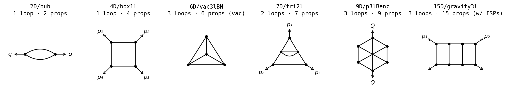

# feynman-bench

> **56,102 worked IBP reductions across 22 multi-loop Feynman topologies (2D – 15D)**,
> produced by FIRE 7 in PRIME mode at a fixed prime (`2017`) and one fixed
> kinematic point per topology. A dataset for training and evaluating
> integration-by-parts solvers — including ML-learned **seeding functions**
> that pick which integrals get fed into the IBP relations.



## Why this dataset

IBP reduction is the rate-limiting step in higher-order Feynman calculations:
every multi-loop integral has to be rewritten as a linear combination of a
small set of "master" integrals using IBP identities. Modern solvers build
a linear system by substituting *seed integrals* into the IBP relations and
solving — and the **choice of seeds** dominates both how large the system
gets and the wall-clock cost of solving it.

This benchmark ships 56k `(target integral, topology) → reduction in masters`
pairs with FIRE's per-target `num_steps` recorded. Train a seeding function
on the train split, evaluate on held-out topologies, **beat the FIRE
baseline's mean step-ratio** while staying valid.

## Quickstart

```bash
# 1. The Python package
git clone https://github.com/project-numina/feynman-bench
cd feynman-bench
pip install -e .

# 2. FIRE in PRIME mode, shipped as a Docker image — building FIRE from
#    source takes hours, this skips it
docker pull ghcr.io/project-numina/fire6:latest
cp config.example.yaml config.yaml             # default: solvers.fire → docker-wrapped FIRE6p

# 3. Baseline on one topology
./run_eval.py --topology 5D/ver2l
```

Drop `--topology` to run the full 9-topology test split. Already have a
local FIRE binary (FIRE7p or FIRE6p)? Skip the `docker pull` and edit
`config.yaml`'s `solvers.fire` to the binary path directly — see
[*Without Docker*](#without-docker) below.

## Leaderboard

<!-- LEADERBOARD-START -->
| # | Name | Solver | Validity | Mean step-ratio | Topologies | Submitted | Files | Notes |
|---|---|---|---|---|---|---|---|---|
| 1 | FIRE 7p baseline | fire | 100.00% | 1.000 | 9/9 | 2026-05-22 | [score](leaderboard/submissions/fire_fire-7p-baseline_20260522_164409/score.json) · [raw](leaderboard/submissions/fire_fire-7p-baseline_20260522_164409/predictions.jsonl) | Reference baseline: FIRE scored on its own GT (test split).  |
| 2 | FIRE 6p | fire | 100.00% | 1.068 | 9/9 | 2026-05-25 | [score](leaderboard/submissions/fire_fire-6p_20260525_164523/score.json) · [raw](leaderboard/submissions/fire_fire-6p_20260525_164523/predictions.jsonl) | FIRE 6p baseline |
<!-- LEADERBOARD-END -->

Lower step-ratio is better. Submit with
`python3 leaderboard/submit.py --score <path> --name <name> --solver <name>`
(see [Score and submit](#score-and-submit) below).

## Dataset

- **22 topologies** under [`topologies/`](topologies/), 2D – 15D. FIRE setup
  files (`.start`, `.lbases`, `.sbases`) are pre-generated and committed; no
  Mathematica or LiteRed needed to consume the dataset.
- **Train / test split** (defined in [`dataset_split.yaml`](dataset_split.yaml)):
  - [`ground_truth_train.jsonl`](ground_truth_train.jsonl) — 13 topologies,
    **56,102 records**.
  - [`ground_truth_test.jsonl`](ground_truth_test.jsonl) — 9 held-out
    topologies, **913 records**, all non-empty reductions.
- **Fixed prime.** Every record uses FIRE's default PRIME-mode field,
  `finite_field = 2017`. Reduction coefficients are integers in `[0, 2017)`.
- **Fixed kinematics per topology.** For each topology, one `params` dict
  (e.g. `{d, m1sq, qsq}`) is sampled once with `--seed 42` (integers in
  `[2, 9999]`) and reused across train and test. Same topology ⇒ same
  numerical kinematic point throughout.

| Split | Topologies |
|---|---|
| Train (13) | 2D/bub, 3D/bub2l, 4D/box1l, 5D/{bl2, bl2em}, 6D/{vac3lBN, vac3lNO}, 7D/tri2l, 9D/{banana3L, grav2l, grav2lx, p3lBenz, p3lLA} |
| Test (9) | 4D/box1lc, 5D/ver2l, 6D/vac3lO4, 7D/tri2lx, 9D/p3lO4, 10D/{vac4lBN, vac4lNP}, 15D/{gravity3l, gravity3lsec} |

### Record schema

One JSON object per line of `ground_truth_*.jsonl`:

```json
{"solver":"fire","topology_path":"5D/ver2l",
 "params":{"d":7646,"m1sq":962,"s1":3547},
 "integrals":[[1,0,2,0,2]],
 "reductions":{"[1, 0, 2, 0, 2]":{"[1, 0, 1, 0, 1]":1478,"[1, 0, 1, 0, 2]":1357}},
 "num_steps":111,"finite_field":2017}
```

Each record carries exactly one target integral and its reduction expressed
in FIRE's chosen master basis. `num_steps` is FIRE's *used*-equations count
from its log (the count of IBP equations actually consumed during the
reduction).

## Metrics

- **Validity** — fraction of integrals where the solver's reduction matches
  the GT exactly under modular arithmetic at the GT prime. Averaged across
  topologies.
- **Step ratio** — `Σ steps_solver / Σ steps_GT` over the integrals the
  solver covered. Lower is better.
- Both are computed over *covered* integrals only; missing predictions are
  reported separately (`n_missing`) so a slow solver isn't punished for
  partial coverage.

## Run an evaluation

```bash
./run_eval.py                                          # full 9-topology test split
./run_eval.py --topology 5D/ver2l                      # one topology
./run_eval.py --topologies 5D/ver2l,9D/p3lO4           # subset (comma-list)
./run_eval.py --ground-truth ground_truth_train.jsonl  # score on train instead
./run_eval.py --max-parallel 32 --threads 4            # tune parallelism
```

Equivalent installed-package form: `feynman-eval …`. Each run writes a
timestamped directory `results/<ts>_eval_<solver>/` with one
`results.jsonl` + `comparison.md` + `score.json` per topology and an overall
`score.json` at the root.

**Parallelism knobs.** `--max-parallel` = concurrent target reductions
(separate FIRE processes — each spawns its own `docker run` when docker
is configured), `--threads` = FIRE-internal thread count per target.
Peak CPU demand ≈ `max_parallel × threads`. Lots of small targets →
push `max-parallel`; few heavy targets → push `threads`.

## Score and submit

Already have a predictions jsonl from your own solver?

```bash
# Score it against the test ground truth
python3 score.py --predictions my_results.jsonl \
                 --ground-truth ground_truth_test.jsonl \
                 --solver my_solver --output my_score.json

# Add the result to the leaderboard
python3 leaderboard/submit.py --score my_score.json \
    --name "My solver v0.1" --solver my_solver \
    --notes "Learned seeding policy, transformer trained on the train split"
```

`submit.py` writes a new directory under
`leaderboard/submissions/<solver>_<slug>_<ts>/` containing both `score.json`
(metrics + provenance) and `predictions.jsonl` (raw output, re-scorable
independently with `check_validity`). It also re-renders the leaderboard
table here and in [`leaderboard/leaderboard.md`](leaderboard/leaderboard.md).
Open a PR to share your row.

Or call `check_validity` directly from Python:

```python
from check_validity import check_validity
report = check_validity("my_results.jsonl", "ground_truth_test.jsonl",
                        solver="my_solver")
print(report["totals"])  # {n_gt, n_covered, n_valid, n_missing, ...}
```

## Want to contribute?

### Add a new solver

1. Create `solvers/<name>/run.py` exposing
   `run(integral, params, topology, *, root_dir, ...) -> dict` that returns
   the parsed reduction in the schema above. The reduction must be in
   **FIRE's master basis** (the same masters the ground-truth records use)
   so `check_validity` can compare directly.
2. Wire `_dispatch_solver` in `run_eval.py` to import your `run`.

### Add a new topology

Each topology needs `parameters.yaml`, `zero_sectors.txt`, and FIRE's
`.start` / `.lbases` / `.sbases` setup files (regenerated from a one-time
Mathematica + LiteRed pass, then committed). See `topologies/2D/bub/` as
the smallest reference. Once the files are in place, add an entry to
[`dataset_split.yaml`](dataset_split.yaml) and run
`./generate_ground_truth.py --topology <dim>/<name>` to seed its records.

Want a specific physics topology added but don't want to do the
Mathematica work yourself?
**[Open an issue](https://github.com/project-numina/feynman-bench/issues/new)**
with the propagator list, masses, and external momenta — we'll consider
adding it.

### Patch FIRE itself

The published `ghcr.io/project-numina/fire6:latest` is fine for running
the benchmark as-is. If you want to **modify FIRE's internals** (try a
different reduction strategy, swap the seeding step, add instrumentation),
the Dockerfile that produces our image lives in
[`docker/fire6/`](docker/fire6/). FIRE source stays upstream — clone
it separately:

```bash
# 1. Get FIRE source (once)
git clone https://gitlab.com/feynmanIntegrals/fire ~/fire

# 2. Patch ~/fire/FIRE6/ to your taste

# 3. Build the image — the helper copies our Dockerfile into the FIRE6
#    dir and runs `docker build`. Tag defaults to `fire6`.
./docker/fire6/build.sh ~/fire/FIRE6

# 4. Point config.yaml at the local tag instead of the published one:
#       solvers:
#         fire:
#           docker:
#             image: fire6
#             binary: /fire/bin/FIRE6p

# 5. Run the benchmark — uses your patched image automatically
./run_eval.py --check                # smoke test
./run_eval.py --topology 5D/ver2l    # one topology
./run_eval.py                        # full test split
```

**Worked example: modifying FIRE's seeding step.** Several places in
FIRE6 expose seeding behaviour. From least invasive to most:

| File | Symbol | What it does | What you'd change it for |
|---|---|---|---|
| `sources/functions.cpp` | **`sort_ibps()`** (`s_fast` set) | builds the per-call seed set and crosses each seed with each IBP relation. **The most natural hook.** | filter / sample / reorder the seed set; plug in a learned policy that scores `s_fast` and keeps the top-k |
| `sources/point.cpp`     | **`level_points_fast(s, pos, neg)`** | recursive lattice walk returning every point at *(pos dots, neg numerators)* from the corner | reshape the walk itself — anisotropic, sampled, biased toward specific propagators |
| `sources/functions.cpp` | **`under_levels(p0, m0)`** | enumerates *which* `(pos, neg)` pairs the Laporta outer loop will visit and in what order | change the level-visitation order — depth-first instead of sum-bounded, priority-queue from a learned heuristic |
| `sources/functions.cpp` | **`lowest_in_sector_orbit_fast()`** (called in `sort_ibps`, line ~700) | collapses each seed onto the symmetry-orbit minimum, dropping duplicates | bypass / weaken symmetry collapsing to study its actual cost; replace with a stronger custom dedup |
| `sources/functions.cpp` | **`improve_ibps()`** (line ~980) | preprocesses the IBP-relation list (sort + presolve) before each seed gets crossed with it | dual to seeding: change the *IBP* side of the cross product. A smaller IBP list ⇒ fewer eqns per seed |
| `sources/functions.cpp` | `if (!common::all_ibps)` in `sort_ibps` (line ~726) | early-breaks the inner IBP loop when seed's degree exceeds the IBP's degree | invert the heuristic; train a per-(seed, IBP) keep/skip classifier here |
| `sources/common.h`      | `common::all_ibps` flag (and friends like `pos_pref`, `disable_presolve`) | runtime flags that gate the heuristics above without recompiling | sweep these first before touching code — sometimes the answer is "the right flag wasn't set" |
| FIRE config `#hint` directive | (parser-level) | lets FIRE consume **precomputed seeds** from a directory of `.hint` files instead of generating them | classic offline-learned-policy setup: train any model elsewhere, dump (sector, seed) pairs to `.hint` files, point FIRE at them |

The "least invasive ⇒ most powerful" axis is roughly: tweak flags →
filter `s_fast` → swap `level_points_fast` → reorder `under_levels` →
generate `.hint` files offline. The first two are quick experiments; the
last is the right shape for a learned model that scores candidate seeds.

A sanity-check change in `sort_ibps` to confirm your build is live:

```cpp
// In sources/functions.cpp, just before the final `return counter;` in sort_ibps:
std::cerr << "[seeding-demo] sort_ibps: " << s_fast.size()
          << " seeds x " << IBPdegree.size() << " IBPs = "
          << counter << " equations\n";
```

Rebuild with `./docker/fire6/build.sh ~/fire/FIRE6`, run
`./run_eval.py --check`, and grep the per-target log:

```bash
ls -t outputs/*/box1lc_fire_log.txt | head -1 | xargs grep seeding-demo
# [seeding-demo] sort_ibps: 8 seeds x 4 IBPs = 26 equations
```

For real experiments, swap the `cerr` for a transform of `s_fast` (filter,
sample, reorder, replace with model predictions, …). Score with
`./run_eval.py`: **validity** tells you the reductions are still correct;
**step ratio < 1.0** means your seeding outperforms the FIRE7p baseline
that produced the ground truth.

## Without Docker

If you'd rather build FIRE locally (or already have it), skip the
`docker pull` from the quickstart. FIRE 7 / FIRE 6 build instructions
live at the
[FIRE gitlab repo](https://gitlab.srcc.msu.ru/feynmanintegrals/fire); the
build must produce a `FIRE7p` (or `FIRE6p`) executable. Then:

```bash
pip install -e .                          # or: pip install -r requirements.txt
cp config.example.yaml config.yaml         # edit: solvers.fire = /abs/path/to/FIRE7p
./run_eval.py --check                      # health check on the smallest target
./run_eval.py --topology 5D/ver2l          # 1-topology baseline
```

## (Re)generate or extend the ground truth

Edit [`dataset_split.yaml`](dataset_split.yaml) (which topologies, which
sector levels, what index range, how many targets per level) then run:

```bash
./generate_ground_truth.py                            # both splits
./generate_ground_truth.py --topology 5D/bl2 --dry-run  # plan only, no FIRE
./generate_ground_truth.py --max-parallel 16 --threads 8 --seed 42
```

Sampling is deterministic from `--seed` (default 42). Re-running with the
same seed gives byte-identical output. Adding a new topology to the split?
See [*Want to contribute?*](#want-to-contribute) above.

## Repo layout

```
run_eval.py               single entry point — eval + scoring
score.py                  validity + step_ratio
check_validity.py         isolated comparison primitive
reductions.py             shared helpers
generate_ground_truth.py  sample targets + run FIRE → ground_truth_*.jsonl

solvers/fire/             FIRE wrapper (library API + CLI, host binary or docker)

docker/fire6/             Dockerfile + build.sh that produce
                          ghcr.io/project-numina/fire6 (FIRE source itself
                          lives upstream; this is just the build recipe)

topologies/<dim>/<name>/
    parameters.yaml       parameter names + FIRE aliases
    zero_sectors.txt      support masks for trivially-zero sectors
    fire/                 pre-generated FIRE setup + templates

leaderboard/
    submit.py             add a run, re-render the table
    submissions/<id>/     {score.json, predictions.jsonl} per row
    leaderboard.md        rendered table

tools/render_topologies.py  regenerate docs/topologies.png
```

## Citation

If you use this dataset, please cite:

```bibtex
@dataset{feynman-bench-2026,
  author    = {Thibaut Barroyer and Shovon Biswas and Yann Fleureau and Jia Li and Julio Parra-Martinez and Mathis Reymond and Marina Vinyes},
  title     = {Feynman IBP benchmark},
  year      = {2026},
  publisher = {GitHub},
  url       = {https://github.com/project-numina/feynman-bench},
  note      = {All authors at Project Numina, except Julio Parra-Martinez at Institut des Hautes \'Etudes Scientifiques, 91440 Bures-sur-Yvette, France}
}
```

## License

MIT — see [LICENSE](LICENSE).
